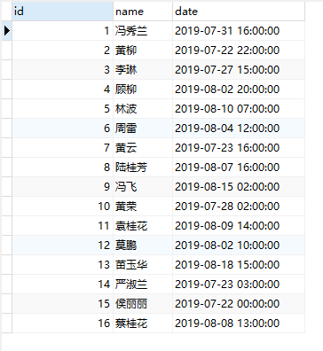

#### 概述

ivy是一个配置化的数据填充框架，主要解决的场景

1. 帮助你更好的去处理开发项目前无数据的尴尬
2. 摆脱手动创建数据库和数据表的繁琐工作
3. 快速生成数据后台所要的模拟数据，帮助你更快编写数据统计的逻辑开发

采用配置化的模式，使工作更加高效。配置多个主机模拟数据只要在文件配一下，就能够实现你想要的效果。

> 核心思想是解放劳动力，让你能够在不编写或最少写代码的情况下完成填充的任务

代码结构：

```text
+---config // 批量操作配置文件目录 
+---ivy 
| +---abstracts // 接口类目录 
| +---functions // 生成随机数的函数目录 
| +---manages // 具体逻辑实现管理目录
+---readme // 文档目录
```

#### 要求

Python3+

Works on Linux, Windows, Mac OSX, BSD

#### 文档

##### 自定义填充函数

在 `functions` 目录下编写相关代码即可。

`__init__.py`

```python
# -*- coding: utf-8 -*-
from ivy.functions.date import Date
from ivy.functions.default import Default

funcs = {
    'range_date': Date().range,
    'default': Default().default
}
```

然后编写相关类即可，可参考 `default.py` 文件

##### default.yml 配置文件（遵循yaml语法）

###### 主要做两个功能：

1. 配置实现数据库，数据表自动创建
2. 填充数据，高度支持faker库

配置文件直接写在 `config` 目录就可以了，不过要注意这里只认识 `.yml` 后缀的配置文件哦。所以只要定义了 yml的文件都会被执行的哦

###### 栗子：

```yaml

- host: 127.0.0.1
  port: 3306
  username: root
  password: root
  charset: utf8mb4
  dbname: faker
  databases:
    - table: faker
      fields:
        id: INT NOT NULL AUTO_INCREMENT
        name: VARCHAR(20) NOT NULL
        date: timestamp NOT NULL
        index:
          - PRIMARY KEY (id)
        other:
          - ENGINE=InnoDB
          - DEFAULT
          - CHARSET=utf8mb4

      rules:
        date:
          func: range_date
          start: '2019-07-20'
          end: '2019-08-20'
          res_format: '%Y-%m-%d %H-%M-%S'
          step: HOUR_TO_SECOND

        name:
          func: faker|name

      number: 5
      chunk: 1
```

###### tips:

- 这里面使用数组的形式进行配置，每个数组对应一个服务器地址， 想要填充多个服务器上面的数据库就需要对其进行数组配置

```text
host: 数据库服务器ip

port: 数据库服务器端口

username: 数据库用户名

password: 数据库密码

charset: 编码

dbname: 创建的数据库名

tables: 数据库表数组

table: 数据表名

flag: 唯一标识字段

fields: 数据表字段

index: 数据表索引

other: 数据表外层engine这些

rules: 数据表字段填充的内容设置

number: 要填充的总数量

chunk: 每组批量插入的数量，避免内存溢出 （每次插入数量 = number / chunk）
```

- 填充的规则定义如下

1. 自定义的处理函数要在 `ivy/functions/__init__.py` 中定义函数名称，就是用在配置中的 `func` 哦。

```yaml
date:
  start: 开始时间
  end: 结束时间
  res_format: 生成的时间格式
  step: 控制时间间隔，具体常量DAY_TO_SECOND，HOUR_TO_SECOND，MINUTE_TO_SECOND,SECOND
name:
  func: default
  value: test
```

2. `faker` 库的调用，这里面要直接带上 `faker` 前缀,然后用|来对其进行分割，这里面不允许使用空格。然后后面带上
   `faker` 库中的函数调用就行了。例如上面例子中，直接使用 `name` 这个函数调用。具体还可以使用什么函数参考 `faker`
   库的官网

https://faker.readthedocs.io/en/master/locales/zh_CN.html

- 使用

1. 安装需要使用的库

```shell
pip install -r requirements.txt
```

2. 配置padding_data.yml文件，这里按照yaml语法配置就可以了

3. 生成数据库并填充数据

```shell
python entry.py
```

4. 效果如下



